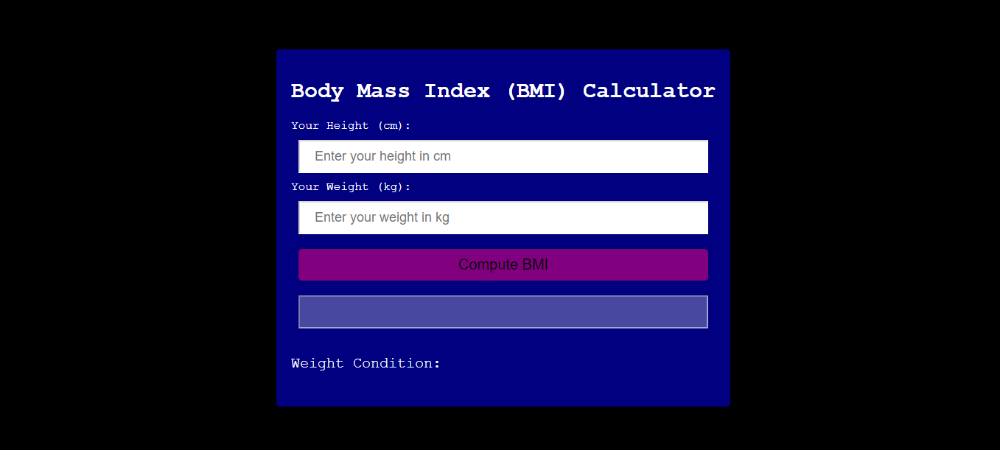
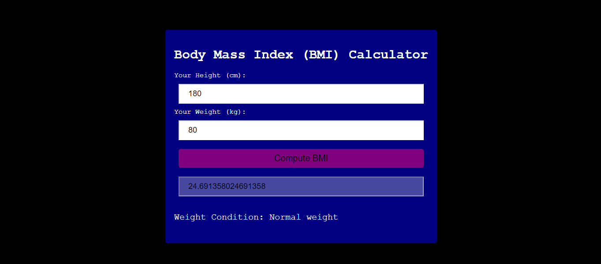

# BMI-Calculator

## Description
The BMI (Body Mass Index) Calculator Web App is a simple and user-friendly application designed to help users calculate their BMI. Built with HTML, CSS, and JavaScript, this web app provides an intuitive interface for users to input their height and weight and instantly get their BMI results along with a brief interpretation.

## Prerequisites
N/A

## Technologies Used
Built with:
* HTML
* CSS
* JavaScript

## Installation
N/A

## Usage
N/A

## Project Link
Application can can be viewed here: 
* [Live](https://yvonnesarah.github.io/BMI-Calculator/)

* [Repository](https://github.com/yvonnesarah/BMI-Calculator)

## Screenshot(S)
BMI Calculator

BMI Calculator Example

## Credit
N/A

## Licence
Please refer to the LICENSE in the repo.