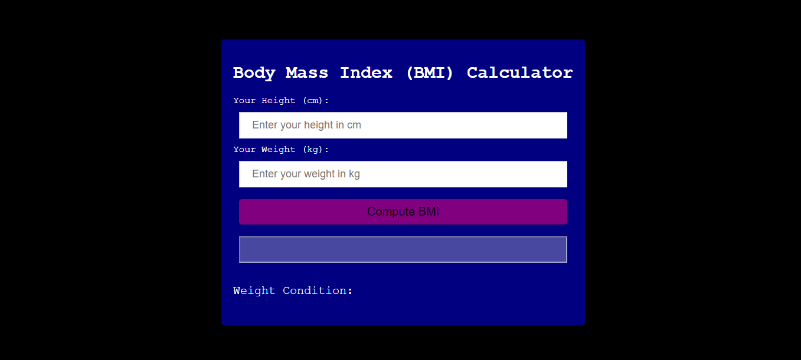
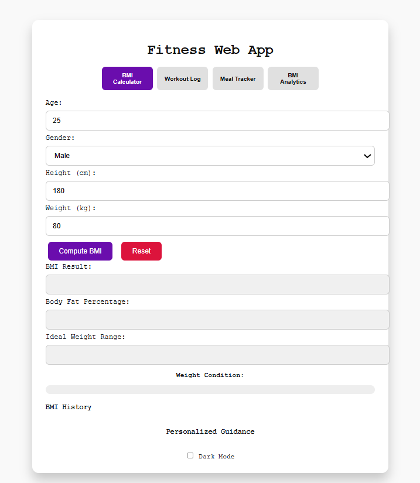
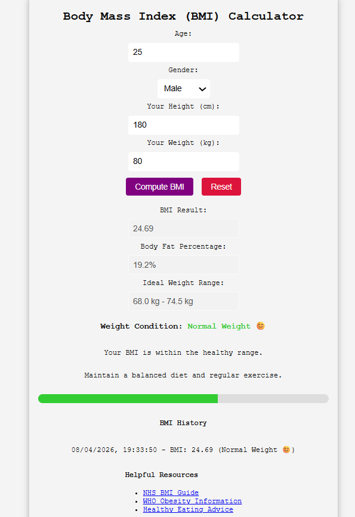
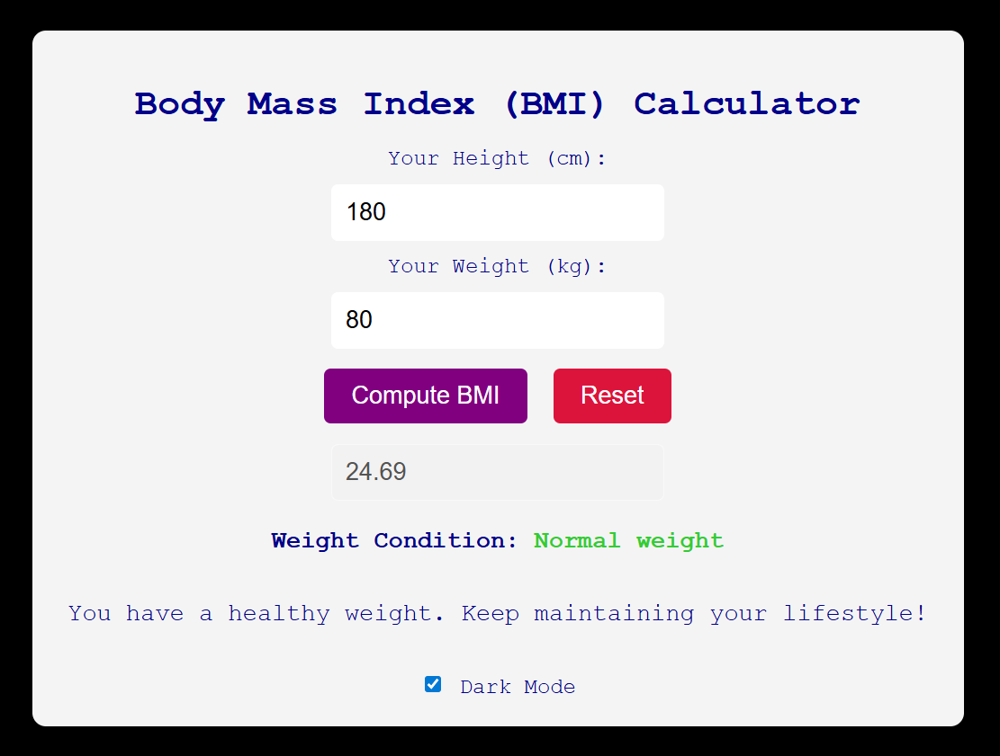

# BMI-Calculator

## 📌 Description
The BMI (Body Mass Index) Calculator is a simple and user-friendly web application designed to help users calculate their BMI. Built with HTML, CSS, and JavaScript, this app provides an intuitive interface where users can input their height and weight to instantly receive their BMI results along with a brief interpretation.

## 🛠 Prerequisites
* A modern web browser (Chrome, Firefox, Safari, Edge)

## 📋 Features
* User-Friendly Interface – Easily input height and weight.
* Accurate BMI Calculation – Computes BMI based on standard formulas.
* BMI Classification – Displays category: Underweight, Normal weight, Overweight, or Obesity.
* Responsive Design – Works seamlessly on both mobile and desktop devices.
* Clear Results Display – Instant and concise output of BMI value and classification.

## 💻 Technologies Used
This project was built using:
* HTML
* CSS
* JavaScript

## 🚀 Installation
No installation required. Simply open the web application in your browser.

## 📚 Usage
1. Open the BMI Calculator web application in your browser.
2. Enter your height and weight in the provided input fields.
3. Click the "Compute BMI" button.
4. View your BMI value and its corresponding classification displayed on the screen.

## 🔗 Live Demo & Repository
Application can be viewed here:
* [Live](https://yvonnesarah.github.io/BMI-Calculator/)

* [Repository](https://github.com/yvonnesarah/BMI-Calculator)

## 🖼 Screenshot(S)
Before Design

BMI Calculator Interface

BMI Calculation Example

After Design

BMI Calculator Interface

BMI Calculation Example

BMI Calculation Example - Dark Theme

## 🚀 Future Improvements
To enhance the functionality and user experience of the BMI Calculator, the following improvements are planned:
* 🟢 BMI Formatting – Display BMI with 2 decimal places for better readability. ✅
* 🆕 Reset Button – Add a button to clear inputs and results quickly. ✅
* ⚠️ Input Validation – Alert users if height or weight is missing or invalid. ✅
* 🎨 Color-Coded Results – Change text colour based on BMI category (underweight, normal, overweight, obesity). ✅
* ✨ Button Animations – Add hover effects for buttons to improve interactivity. ✅
* 📊 Detailed Health Insights – Provide personalized recommendations based on BMI results. ✅
* 🎨 Theme Customization – Offer light/dark mode or colour themes for better accessibility. ✅
* 📱 Mobile Optimization – Further refine UI/UX for mobile and tablet devices. ✅

## 🆕 Upcoming Enhancements
Age & Gender Consideration
* Age input: Adjust BMI interpretation for age-specific ranges ✅
* Gender input: Tailor health advice and BMI evaluation based on gender ✅
* Enhanced insights: Show personalized health messages considering age and gender ✅

Advanced Health Metrics
* Body fat calculator: Estimate body fat percentage based on BMI, age, and gender ✅
* Ideal weight range: Suggest target weight range for the user’s height based on BMI and height ✅

Visual Feedback
* Dynamic color-coded BMI meter: Instantly shows category through color changes ✅
* Animated progress bar: Indicates BMI position within the healthy/target range ✅
* Emoji/icon indicators: Fun visual feedback corresponding to weight condition ✅

History & Tracking
* LocalStorage: Save BMI results for historical tracking ✅

Personalized Recommendations
* Motivational messages: Encourage lifestyle improvements and goal setting ✅
* Resource links: Provide trusted health websites or guides ✅

## 🚀 Advanced Future Improvements (Professional Level)

## 👥 Credit
Designed and developed by Yvonne Adedeji.

## 📜 License
This project is open-source. For licensing details, please refer to the LICENSE file in the repository.

## 📬 Contact
You can reach me at 📧 yvonneadedeji.sarah@gmail.com.
