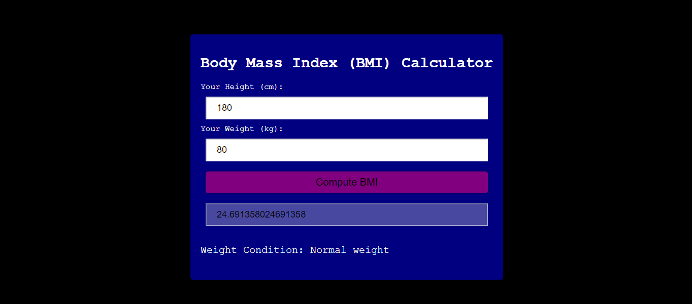

# BMI-Calculator

## 📌 Description
The BMI (Body Mass Index) Calculator is a simple and user-friendly web application designed to help users calculate their BMI. Built with HTML, CSS, and JavaScript, this app provides an intuitive interface where users can input their height and weight to instantly receive their BMI results along with a brief interpretation.

## 🛠 Prerequisites
N/A

## 📋 Features
* User-Friendly Interface – Easily input height and weight.
* Accurate BMI Calculation – Computes BMI based on standard formulas.
* BMI Classification – Displays category: Underweight, Normal weight, Overweight, or Obesity.
* Responsive Design – Works seamlessly on both mobile and desktop devices.
* Clear Results Display – Instant and concise output of BMI value and classification.

## 💻 Technologies Used
This project was built using:
* HTML
* CSS
* JavaScript

## 🚀 Installation
No installation required. Simply open the web application in your browser.

## 📚 Usage
1. Open the BMI Calculator web application in your browser.
2. Enter your height and weight in the provided input fields.
3. Click the "Compute BMI" button.
4. View your BMI value and its corresponding classification displayed on the screen.

## 🔗 Live Demo & Repository
Application can be viewed here:
* [Live](https://yvonnesarah.github.io/BMI-Calculator/)

* [Repository](https://github.com/yvonnesarah/BMI-Calculator)

## 🖼 Screenshot(S)
BMI Calculator Interface

BMI Calculation Example

## 👥 Credit
N/A

## 📜 License
This project is open-source. For licensing details, please refer to the LICENSE file in the repository.

## 📬 Contact
You can reach me at 📧 yvonneadedeji.sarah@gmail.com.
